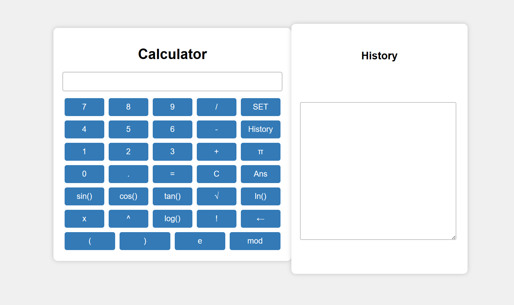

# EE308-Assignment2-Front-end
## Calculator Web Application

This is a simple calculator web application built using HTML, JavaScript, and jQuery. You can use it to perform various mathematical operations, store and retrieve calculation history.

## Features

- Arithmetic operations (addition, subtraction, multiplication, division)
- Trigonometric functions (sine, cosine, tangent)
- Mathematical constants (π, e)
- Exponentiation and logarithmic functions
- Square root (√)
- Factorial (!)
- Modulus (mod)
- History tracking

## Usage

1. Clone this repository or download the source code.
2. Open the `index.html` file in your web browser.

## How to Use

- Use the buttons on the calculator to input numbers and perform operations.
- The "SET" button saves the current calculation to the history.
- The "History" button allows you to view your previous calculations.
- The "Ans" button displays the result of the last calculation.
- The "C" button clears the display.
- Use "←" to delete the last character.
- The "=" button computes the result.

## Screenshots

## Credits

- This web application was created by [Cai Zhengyang] and is open-source for learning and demonstration purposes.

